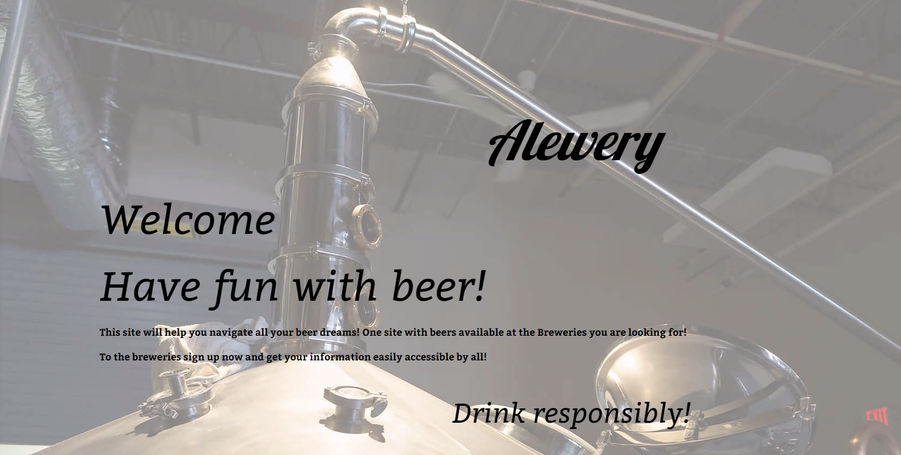
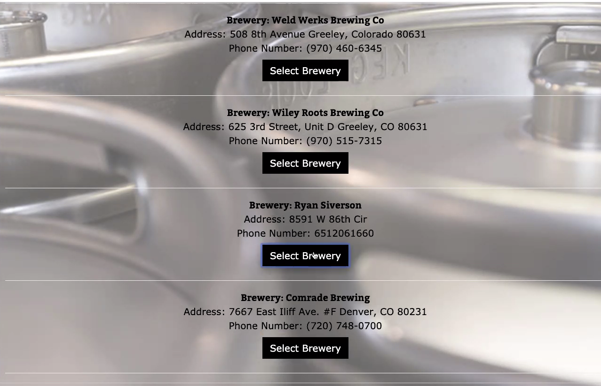
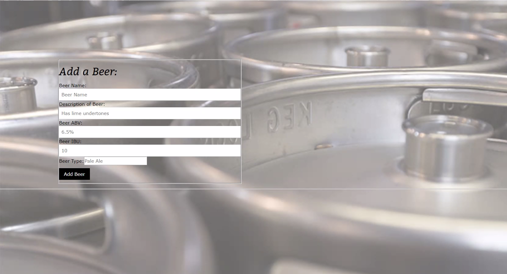
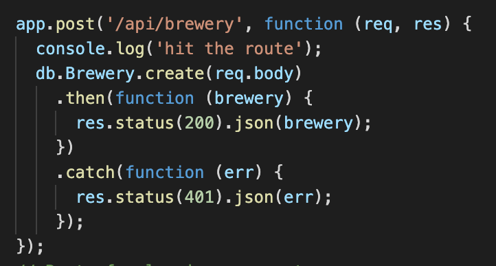

# README

## Project 2 - Express Node MVC
## Alewery - A Front Range Taproom Resource
### Maria Nevarez, Ryan Siverson, and Brandon Nelson
### https://github.com/mnevarez01/express-node-project

## User Story
I’m a BREWERY who wants to SECURELY create and log into a web-based resource where I can add and update the selection of beers I’m currently offering to Colorado Front Range taproom customers.
As a BREWERY, I want to be able to add and update the beers I’m serving to the app’s database. I want to store my address, email, and phone number. 

## Description
Enter Alewery. We are a front range taproom resource for beer selection, description, quantity, and location.
We are a service for breweries and, potentially, consumers. We allow a brewery to expose their taproom selections to consumers. We allow consumers to quickly find their preferred beer selections and where they can go to enjoy those selections today.

## Technologies Used
Node.js, Express, Express-Session, Sequelize, JavaScript, HTML, CSS, PUG, MySQL, BCRYPT, BCRYPTJS, Passport, Routes.

## Screenshots

## Example Code

## Installation
- Run npm install through terminal.
- Direct your browser to localhost:8080.